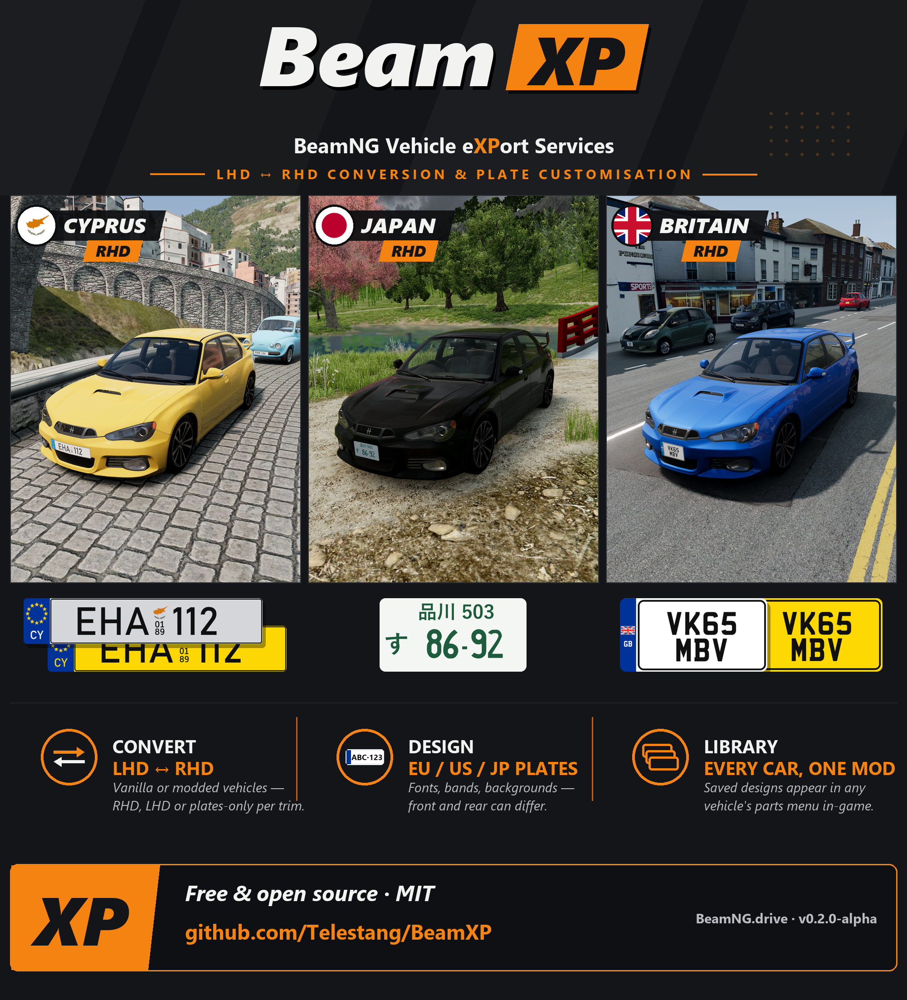

# BeamXP - BeamNG Vehicle eXPort Services

Convert any BeamNG.drive vehicle — vanilla or mod — between left-hand drive and right-hand drive, and generate custom licence plates.

**[Download BeamXP 0.2.2-alpha](https://github.com/Telestang/BeamXP/raw/main/release/BeamXP-0.2.2-alpha-windows.zip)** — extract it anywhere and run the exe.

*BeamXP was previously named BeamHDC (BeamNG Hand Drive Converter).*



The aim is practical gameplay use: convert a car into the driver's preferred handedness with as little manual work as possible. The tool keeps the source vehicle physics, drivetrain, suspension, tires, handling, and damage model intact. It changes the visible driver environment by mirroring, translating, and remapping selected meshes and visual JBeam references.

| Stock LHD | Converted RHD |
| --- | --- |
|  |  |

## Demo

All 39 vanilla ETK 800-Series trims converted to RHD in 4 minutes 30 seconds — under 7 seconds per trim. Click to watch:

<a href="https://www.youtube.com/shorts/5jT2sWg6tlI"></a>

## Status

The tool is new. It has been working well in my own testing, but there may be issues I am not aware of yet. If you find something, please take the time to report it.

## What It Does

- Converts in both directions: LHD to RHD and RHD to LHD.
- Lists `.pc` variants/trims and batch converts all selected variants in one build.
- Can export a converted trim, a Plates Only copy of the original trim, or both in one vehicle mod.
- Generates custom EU, US, and JP licence plate designs: fonts, colours, borders, side bands, background images, emboss, and registration patterns, with a live front/rear preview.
- Keeps reusable licence-plate sets in a global library and exports them as one universal plates mod, so every design is selectable on any vehicle — refreshed automatically on each install.
- Selects front and rear plate meshes independently from BeamNG's shared vanilla physical-plate library; each trim's stock part is labelled `(default)` and `None` is available per side.
- Shows a live in-app 3D preview of the conversion that updates as you work.
- Builds one output mod zip containing all selected XP trim outputs and installs it into your BeamNG mods folder.
- Lets each part be set to `Skip`, `Translate`, `Mirror Aesthetic`, or `Mirror Structural` — via an in-table dropdown or the `Q`/`W`/`E`/`R` hotkeys.
- Recommends part modes automatically (`Recommend Modes`): left/right structural pairs, driver controls, screens, and asymmetric interior parts, with rules tuned against hand-verified conversions.
- Un-mirrors the texture on mirrored display screens (`Flip Tex`) so satnav and infotainment content keeps its left/right reading.
- Detects steering side where possible.
- Estimates the translate distance from an auto-detected steering-wheel reference part; detection re-runs on load whenever a project has no reference set.
- Allows per-part translate offsets.
- Converts internal camera positions automatically.
- Filters the part list to parts used by the selected variants.
- Loads any BeamNG vehicle `.zip`, including zips with multiple vehicle IDs.
- Optionally opens a Blender preview.

## Quick Start

1. [Download the release zip](https://github.com/Telestang/BeamXP/raw/main/release/BeamXP-0.2.2-alpha-windows.zip), extract it, and run the exe (or run from source — see Requirements).
2. Select a source BeamNG vehicle `.zip`.
3. If prompted, choose the vehicle model ID.
4. Select the variants/trims you want to convert.
5. Click `Recommend Modes` to auto-fill the common cases, then set the rest by hand — click a part's `Mode` cell for a dropdown, or select part(s) and press `Q` (Skip), `W` (Mirror Aesthetic), `E` (Mirror Structural), or `R` (Translate):
   - `Translate` for steering wheels, pedals, gauges, stalks, screens, and other driver-specific interior items.
   - `Mirror Aesthetic` for parts that only need visual mirroring.
   - `Mirror Structural` for paired parts where you want the opposite-side mesh on the existing structure, such as door cards or mirrors.
6. Mark the steering wheel part as `Steering Ref` if automatic delta detection needs help.
7. Optionally set `Licence plates` to a custom design or a saved set — see Licence Plates below.
8. Use the in-app preview or Blender preview to inspect alignment.
9. When the preview looks right, set the BeamNG mods folder and click `Build + Install`.

Enjoying driving from the other side? Star the repo to help other people find it, or support development on [Ko-fi](https://ko-fi.com/telestang).

## Requirements

### Windows Build (Recommended)

This is the intended way to run the tool. Download the release zip, extract it anywhere, and run:

```text
BeamXP.exe
```

No Python install is required. Blender is optional and external; set the path to `blender.exe` inside the tool if you want Blender previews.

The tool itself does not need to live in the BeamNG `mods` folder. Configure the BeamNG mods folder inside the app so `Build + Install` can copy generated conversion zips there.

### Running From Source

- Windows
- Python 3.11 or newer recommended
- Tkinter, normally included with the standard Windows Python installer
- BeamNG.drive source vehicle zips
- Optional: Blender 4.2+ for the Blender preview

Install Python packages:

```powershell
pip install -r requirements.txt
```

`requirements.txt` covers the in-app preview (numpy, moderngl) and preview image handling (Pillow). PyInstaller is only installed by the packaging script if you build the Windows exe yourself.

The tool can still build conversions without Blender configured.

### Linux

A user has reported the Windows build running on Linux under Wine without issue.

BeamNG itself runs through Proton on Linux, so point the mods folder at the Proton prefix, for example:

```text
~/.steam/steam/steamapps/compatdata/284160/pfx/drive_c/users/steamuser/AppData/Local/BeamNG.drive/current/mods
```

Running from source natively should also work - nothing in the tool is Windows-only - but I haven't tested it. If you try it, let me know how it goes.

## In-App Preview


The main window includes a live 3D preview of the selected `Config` trim. Feedback is instant: changing a part mode, offset, plate mesh, or any other conversion setting updates the preview immediately, with no build step.

- Left-drag orbits, right- or middle-drag pans, and the mouse wheel zooms.
- Click a part in the viewport to select it in the parts table.
- `H` (or `Shift+H`) hides/unhides the selected parts.
- The `Opacity` slider makes the vehicle see-through so you can check buried interior parts.
- The `Original layout` checkbox removes the hand-drive mesh/prop transforms while retaining the selected replacement plates.
- Parts are coloured by mode: grey for non-transformed parts, blue for `Translate`, orange for `Mirror Aesthetic`, and pink for `Mirror Structural`.


The in-app preview shows one trim/variant at a time.

## Blender Preview

The Blender preview is optional. Use it when you want to inspect the complete generated trim with full Blender tooling; the in-app preview is the quicker feedback loop for day-to-day tuning.

The preview:

- Builds the current unpacked output first.
- Uses the selected `Config` entry.
- Imports the final resolved vehicle for that output, including generated converted meshes and unchanged context meshes.
- Does not require the BeamNG Blender JBeam Editor add-on.
- Opens as a new unsaved Blender instance; nothing is written to disk unless you save it yourself from Blender.

If Blender is not configured, zip generation still works.

For fine offset tuning, select the part that needs adjustment in a Blender preview, move it on Blender's X axis until it lines up, then copy that X movement into the tool as a manual global or per-part offset.

## Part Modes

`Recommend Modes` scans the used-parts list and proposes a mode per part from its name: left/right pairs (door cards, mirrors, seats) become `Mirror Structural`, driver controls and instruments become `Translate`, asymmetric interior parts become `Mirror Aesthetic`, display screens get `Mirror Aesthetic` with `Flip Tex`, and one-sided seat or mirror hardware with no opposite counterpart is mirrored across. The rules are tuned against hand-verified conversions — the entire vanilla ETK 800-Series recommends correctly with no manual fixes. Review the list and apply the rows you agree with; nothing is changed until you apply.

### Translate

Moves the visual mesh laterally without mirroring it. Use this for parts that should stay oriented the same relative to the driver:

- Steering wheel
- Gauge cluster
- Needles and screens
- Pedals
- Stalks
- Driver-specific controls

For translated props, the tool keeps the original `idRef`, `idX`, `idY`, rotations, and animation values, and adds `baseTranslationGlobal` so animated props rotate around the translated visual position.

### Mirror Aesthetic

Mirrors the generated mesh visually. For large symmetric interior parts such as dashboards, centre consoles, and headliners, this is a non-issue: the result deforms on par with the stock vehicle.

Where mirroring creates a significant visual asymmetry — a vehicle with only a driver-side wing mirror, a race car with a single front seat — the deformation will follow the original physical side and won't look right in severe crashes. That is a trade-off of using this tool; use `Mirror Aesthetic` where you need it.

### Mirror Structural

Swaps an opposite-side mirrored mesh onto the existing source-side JBeam structure. This is useful for paired parts like door cards or mirrors where you want the visual side to change but still deform with the existing door/mirror structure.

### Flip Tex

Mirroring a mesh also mirror-images its texture. That is correct for most trim, but wrong for parts that display readable content — a satnav/infotainment screen, badges, decals with text. Toggle `Flip Tex` on a `Mirror Aesthetic` part to reflect its texture coordinates horizontally along with the geometry, so the image keeps its normal left/right reading. The reflection happens within the part's own UV footprint, so it keeps sampling the same region of a shared texture atlas. `Mirror Structural` deliberately does not offer it: that mode swaps in the opposite-side mesh, which already carries its own correct texture mapping. `Recommend Modes` proposes it automatically for display screens.

## Licence Plates

Each trim can carry its own plate setup. Pick `Off`, `Custom`, or a saved plate set in the `Licence plates` dropdown (or per trim in the `Plates` column of the variants table), then `Configure...` opens the plate editor. A trim's converted and Plates Only outputs deliberately share one plate selection.

### Plate designs

Three plate families are supported: `EU` (wide), and `US` and `JP` (both 2:1). Every design has:

- **Font** — plate fonts are not bundled, because most plate-style fonts are not licensed for redistribution. The default uses a plain system font; for authentic lettering, drop `.ttf`/`.otf` files into the BeamXP fonts folder (`Folder` opens it). `Links...` lists plate-style fonts advertised as free for personal use — UK, German/EU DIN and FE-Schrift, Dutch, and more. Combined with the EU template's colours and bands, the right font can reproduce pretty much any country's plate.
- **Registration pattern** — `@` = letter, `#` = digit, `~` = letter or digit, `.` = centre dot. Exported trims get a generated registration from the pattern; on unexported stock vehicles BeamNG keeps supplying its own text.
- **Background images** — optional separate front and rear uploads, for any family, sitting beside the matching colour controls. Images scale to fill the plate and centre-crop the overflowing dimension, overriding that side's background colour; a side without an image keeps its solid colour. Like a distinct rear colour, a front/rear image mismatch needs a converted or Plates Only trim. Ideal upload sizes match the rendered texture canvases: **1024×196** for the wide EU plate (52-11) and **512×256** for the squarish US/JP plate (30-15) — clean multiples (2048×392, 1024×512, ...) also map exactly; any other aspect ratio gets centre-cropped. Note that an enabled side band is drawn opaquely over the left 11% of the EU image, so either leave that strip as throwaway background or paint your own band and set the side band to `None`.
- **Emboss strength** and an optional **border** (colour, offset, thickness, corner radius).
- A **live preview** with a front/rear toggle and a `Regenerate` button for the sample registration.

Family-specific options:

- `EU`: front and rear background colours (the rear colour applies to exported trims; stock vehicles use the front colour on both sides), font colour, horizontal text offset, character spacing, and a side band — the EU band with a country code, or a fully custom band with its own colour, code text, emblem, or full band image. The text offset shifts the registration left or right of its band-aware centre, e.g. to clear a centre emblem in a background image.
- `US`: background colour, font colour, text scale, horizontal/vertical text offsets, and character spacing.
- `JP`: plate style (Private white, Kei yellow, Commercial green, Kei commercial black), region, classification, and kana; the registration pattern fills the main number (e.g. `##-##`).

### Plate library

`Library...` manages reusable plate sets: `New`, `Duplicate`, `Rename`, `Delete`, `Edit`. Set references are live — editing a set updates every conversion that references it, and builds embed a snapshot as a fallback. `Export plates mod...` writes any selection of sets into one universal `BeamXP_plates.zip` that works from the parts menu on all supported vehicles, and can install it straight into the configured mods folder. Every `Build + Install` also refreshes this mod automatically with the entire library, so all library designs stay selectable on any vehicle — not just the sets bound to the installed conversion. On XP-converted trims, switching between library designs in-game keeps the correct rear texture (every design carries rear-format variants); on stock vehicles, plate-set designs use the front colour on both sides.

### Physical plate meshes

Independently of the design, each trim's front and rear physical plate parts can be swapped using BeamNG's shared vanilla plate meshes. The trim's stock part is labelled `(default)` and `None` removes the plate on that side. Different front/rear background colours need a converted or Plates Only trim because the tool must clone a rear plate part to carry the second texture.

## Physics And Deformation Notes

The tool does not move the physical JBeam structure for driver controls. The physical steering wheel, pedals, handbrake, and similar interior structures remain where they are in the source vehicle. The generated mod moves their visual representation.

Visual deformation is still driven by the source vehicle's physical deformation. For `Translate` parts, this can mean severe crash damage deforms the visual part according to its original physical side. For example, a heavy left-side impact that would deform the driver's side of a LHD car may visibly affect a translated RHD driver's visual part even though that visual part is now on the right.

`Mirror Aesthetic` on symmetric parts such as headliners, dashboards, and centre consoles deforms on par with the original base vehicle. The original-physical-side caveat only applies when `Mirror Aesthetic` results in visual asymmetry — for example, a vehicle that only has a driver-side wing mirror, or a race car with a single front seat.

`Mirror Structural` swaps an opposite-side mesh onto an existing opposite-side structure, so deformation behaves on par with the original base vehicle.

## Output

Projects are saved under:

```text
%LOCALAPPDATA%/BeamXP/handedness_conversion_projects/<projectName>/
```

The app settings file is saved beside the projects under `%LOCALAPPDATA%/BeamXP/`. (Data from BeamHDC-era builds under `%LOCALAPPDATA%/BeamHDC/` is moved there automatically the first time BeamXP runs.) This keeps user work stable even if the app folder or exe is replaced during an update.

Each project contains:

- `conversion.json`: saved tool settings for that source zip name and vehicle ID
- `unpacked_output/`: generated mod folder
- `build/`: generated mod zip
- `blender_preview/`: Blender preview working files (payloads and extracted DAE caches), if used

The configured BeamNG mods folder is only used as the install target for generated conversion zips.

Vehicle builds use the filename `<source>_XP_conversion.zip`. Each trim's `Build` cell can be `Off`,
`Converted`, `Plates Only`, or `Both`, so a converted and a Plates Only copy of the same source trim can
live in that one archive. The in-app `Config` dropdown still lists that source trim only once; `Original
layout` changes the previewed transform state without changing its selected plates.

Reusable plate sets are stored separately under `%LOCALAPPDATA%/BeamXP/plates/`. Renaming a set is
safe because projects reference its fixed ID. Builds resolve the latest set contents and embed a
snapshot; if a referenced set is later deleted, the snapshot is used with a build warning.

Model-local custom designs are labelled `Custom (<vehicle ID>)` and `Custom (<config name>)`. Once a
trim custom exists, other trims can select it and share the same live definition without adding it to
the global library. BeamNG's parts menu can still switch either vehicle to any generated custom or
library design in game.

The output mod zip also embeds a copy of the conversion settings at:

```text
handedness_conversion/conversion.json
```

`projectName` is normally the vehicle ID when the zip name matches it, such as `sunburst2`. If a zip contains a differently named vehicle folder, the project name includes both the zip name and vehicle ID.

## Example Configs

The `examples/conversion_configs/` folder contains example conversion settings:

- `sunburst2_batch_conversion.json`: Hirochi Sunburst, all 39 variants LHD to RHD
- `bx_batch_conversion.json`: Ibishu 200BX, all 36 variants RHD to LHD

These are settings examples, not source vehicles. To use one:

1. Load your own matching source vehicle zip.
2. Use `Import Config`.
3. Select the example config.
4. The tool imports only matching variants and part names.

Converted vehicle zips are not included because this repository is MIT licensed and cannot include BeamNG source vehicle files under that license. The example configs use vanilla BeamNG vehicles and contain settings only.

## Known Limitations

- Some vehicles use sloppy, inconsistent JBeam syntax. The parser handles several known quirks, but more may appear.
- Some community mods have off-center geometry or inconsistent object origins. Use manual global or per-part offsets.
- Some animated props may need vehicle-specific attention.
- Texture paths in Blender preview may not resolve exactly like BeamNG's material system.
- Wheel-attached meshes (road wheels, hubcaps, tires) may not be positioned correctly in previews. The game places them at runtime on wheel node groups generated by the wheel system, which the previews do not model. Generated output zips are unaffected; the game positions them correctly.
- Severe crash deformation of translated or asymmetrically mirrored interior visuals may not perfectly match a hand-authored conversion.
- In the first-person driver camera, the "lean head out of the window" movement is clamped on right-hand-drive vehicles: the head barely exits the window when looking toward the driver's side. This is a BeamNG engine bug (a frame mismatch in the driver camera's window-margin calculation in `lua/ge/extensions/core/cameraModes/driver.lua`), not a conversion defect — official RHD vehicles such as the vanilla 200BX are affected identically, and it has been [reported to BeamNG along with a fix](https://www.beamng.com/threads/rhd-driver-camera-bug.110306/). Converted cameras match the official RHD camera setup exactly, so please don't report this one here.

## Reporting Issues

Open a GitHub issue with three things:

- The source vehicle zip (or where to get it)
- The conversion settings: your project `conversion.json`, or the `handedness_conversion/conversion.json` embedded in the built zip
- A description of what is going wrong

With the zip and the config file, the attempted conversion can be reproduced exactly in the app via `Import Config`.

## Support

If this tool saved you from doing a conversion by hand, consider [buying me a coffee on Ko-fi](https://ko-fi.com/telestang). It keeps the project going.

Starring the repo helps too - it's free and it makes the tool easier for others to find.

## License

Tool code is MIT licensed. Generated output zips are not automatically MIT licensed; they may include or derive from the source vehicle's assets and remain subject to the source asset licenses.
